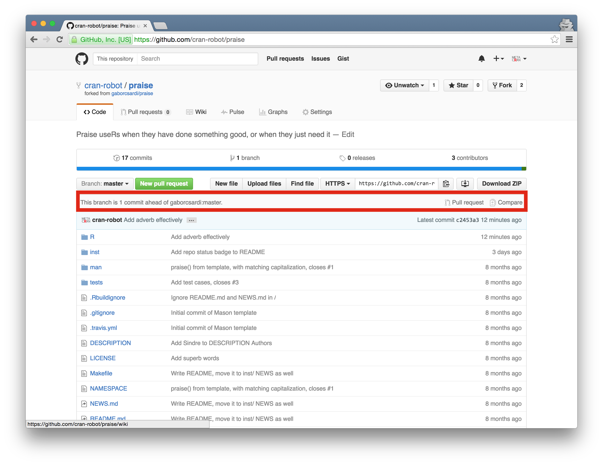
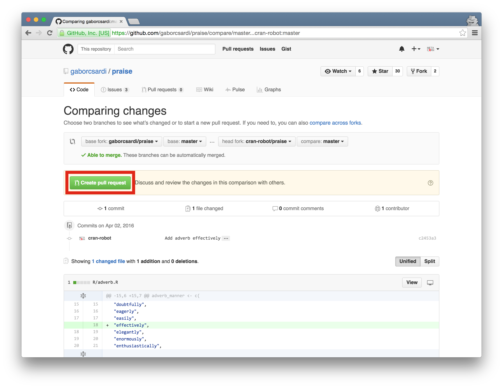
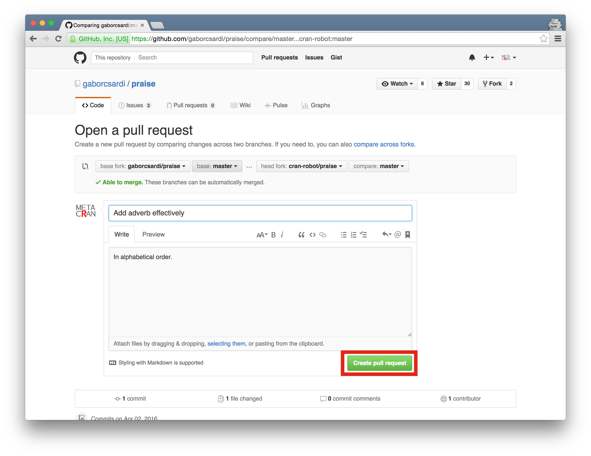
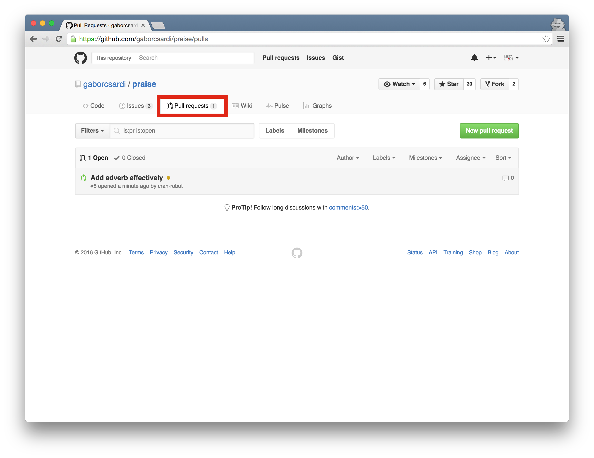
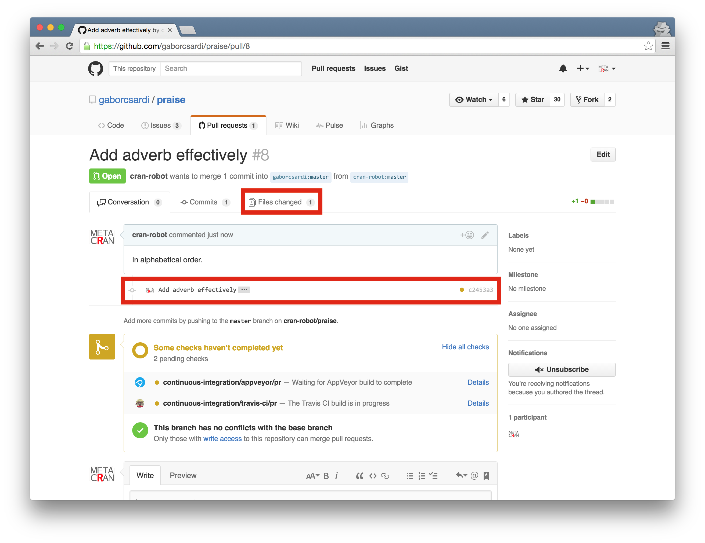
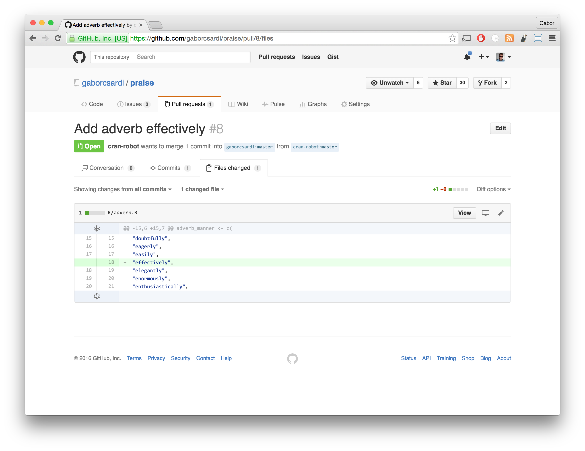
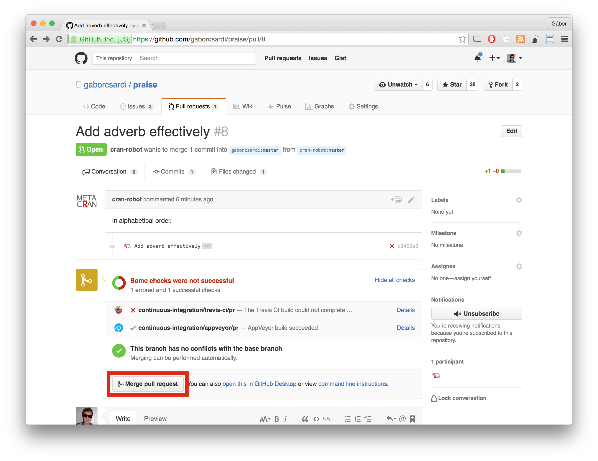
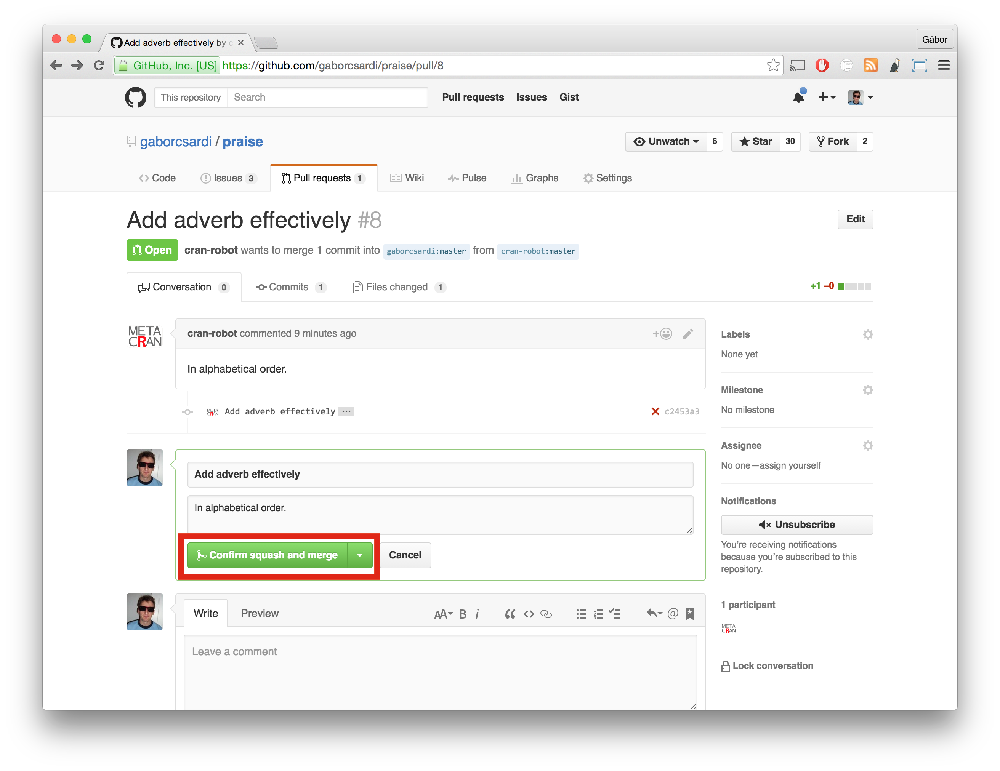
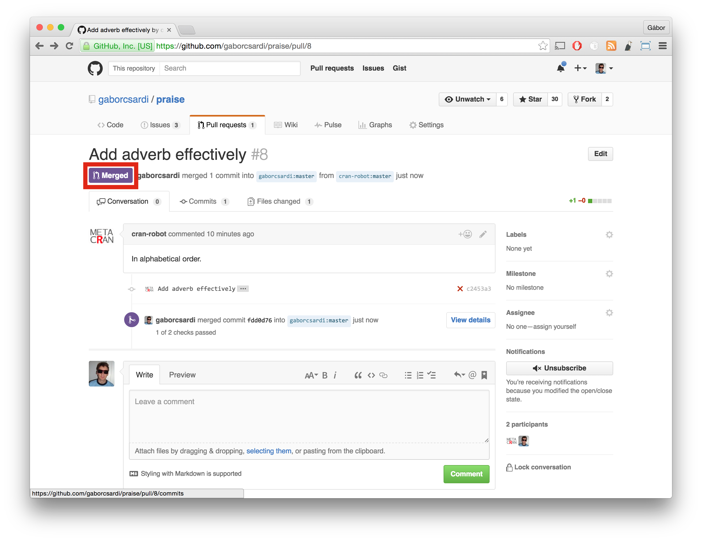
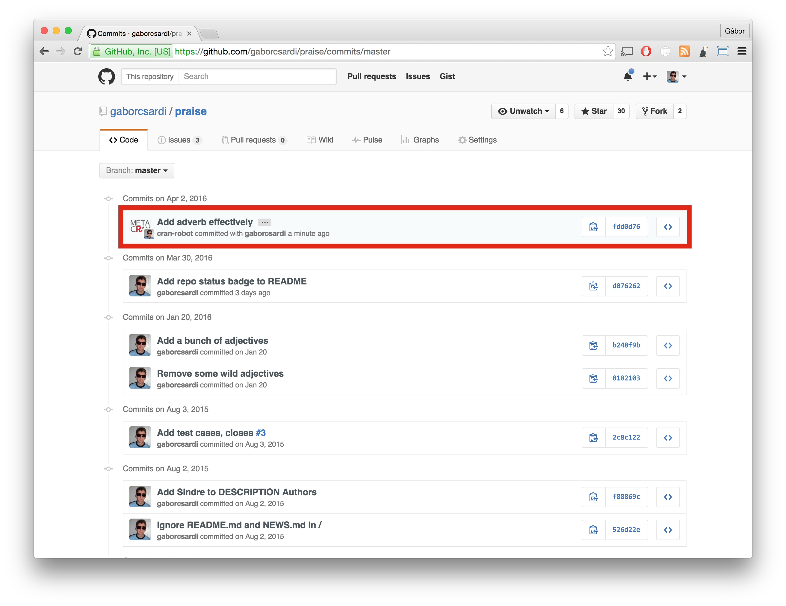

# Pull requests { .shout }

# { .fullpage }

Pull requests

# { .fullpage }

Pull requests

# { .fullpage }

Pull requests

# { .fullpage }

Pull requests

# { .fullpage }

Pull requests

# { .fullpage }

Pull requests

# { .fullpage }

Pull requests

# { .fullpage }

Pull requests

# { .fullpage }

Pull requests

# { .fullpage }

Pull requests

# Pull request summary for contributor

1. Fork repository
2. Make changes
3. Create pull request
4. Wait for feedback
5. Update your pull request according to answer
6. Make a comment
7. Iterate 4-6 until merged or closed

# Pull request summary for maintainer

1. Review pull request
2. Provide feedback
3. Wait for update
4. Iterate 2-3 until good for merge, or need to close

# Exercises

## 1. Submit a pull request to the gaborcsardi/praise repository

## 2. Update your pull request based on the feedback, until closed or merged
