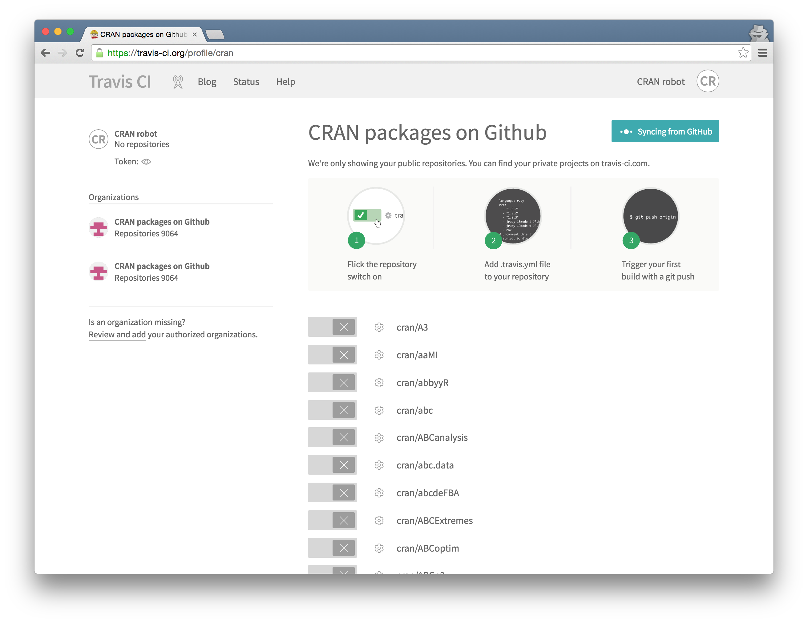
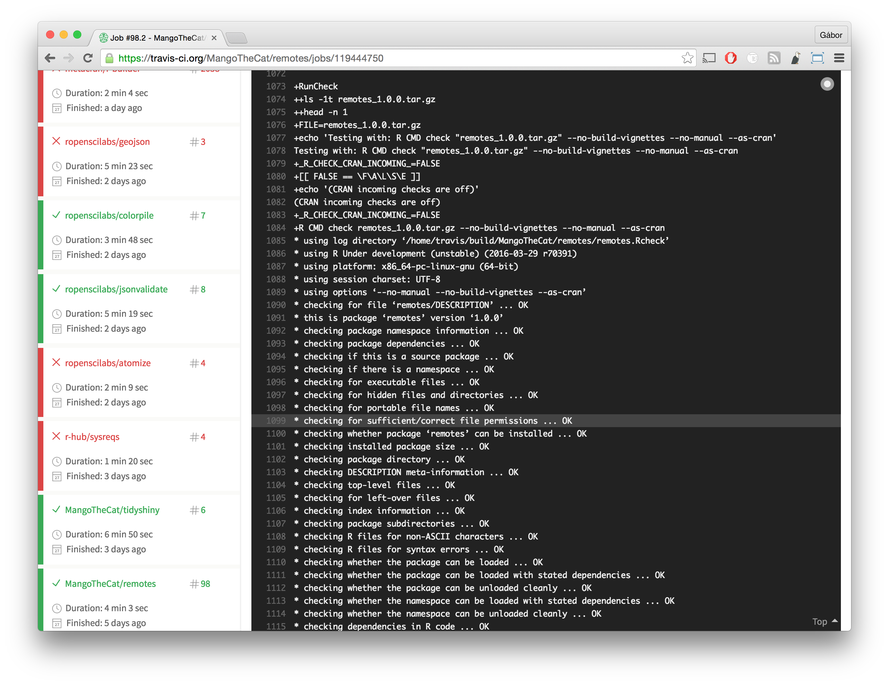
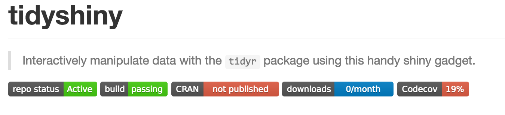
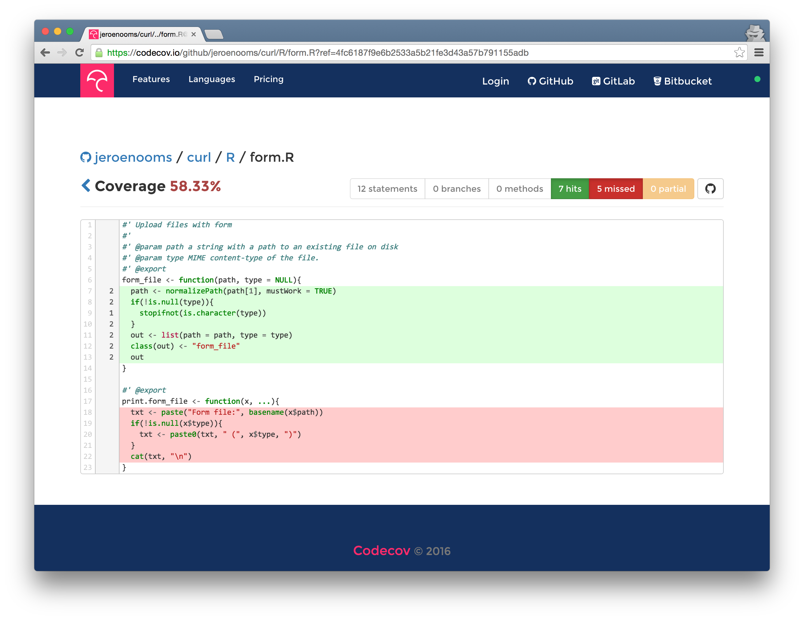

# R & GitHub Good Practices
Gábor Csárdi  

# Continuous Integration { .shout }

# What is CI?

> Continuous integration (CI) is the practice, in software engineering,
> of merging all developer working copies to a shared mainline
> several times a day.

**Wikipedia** https://en.wikipedia.org/wiki/Continuous_integration

# What is CI?


# Travis CI { .shout }
<p class="subtitle">https://travis-ci.org/</p>

# { .fullpage }

<p class="subtitle subtitletop">https://travis-ci.org/</p>

# { .fullpage }

<p class="subtitle subtitletop">Login with GitHub</p>

# { .fullpage }

<p class="subtitle subtitletop">Add a repository</p>

# { .fullpage }

<p class="subtitle subtitletop">Choose repository to add</p>

# { .fullpage }

<p class="subtitle subtitletop">Build history (empty)</p>

# { .fullpage }

<p class="subtitle subtitletop">Build history</p>

# { .fullpage }

<p class="subtitle subtitletop">Build output</p>

# Set up Travis for an R package

## 1. Create `.travis.yml` file:

```
language: R
sudo: false
cache: packages
```

## 2. Add it to the repository

## 3. Omit it from the R package, create `.Rbuildignore`:

```
^\.travis\.yml$
```

## 4. Commit and push

# Add a `README.md` file, and a badge:

```markdown
[]
(https://travis-ci.org/<user>/<repo>)
```



# Exercises

## 1. Register on https://travis-ci.org

## 2. Turn on Travis for your repository

## 3. Add a `.travis.yml` file to your repository

## 4. Push the new version to GitHub

## 5. Add a badge to your `README.md` file

# Test coverage { .shout }

# What is test coverage?

> Code coverage is a measure of the amount of
> code being exercised by the tests. It is an indirect measure of test quality.

**Jim Hester**, `covr` package author

# Set up test coverage runs on Travis

## Extend your `.travis.yml` file:

```
...
r_github_packages:
  - jimhester/covr

warnings_are_errors: true

notifications:
  email:
    on_success: change
    on_failure: change

after_success:
  - Rscript -e 'covr::codecov()'
```
  
# Codecov { .shout }

# { .fullpage}

<p class="subtitle subtitletop">https://codecov.io/{user}/{repo}</p>

# Exercises

## 1. Add (dummy?) tests to your repository

## 2. Add code coverage support on Travis

## 3. Push the new version to GitHub

## 4. Add a badge for code coverage to `README.md`

<!-- # git Branches { .shout } -->

# Good Practices<br> for R packages { .shout }

# { .fullpage }

<p class="subtitle subtitletop">Tests</p>

# { .fullpage }

<p class="subtitle subtitletop">`README.md` file</p>

# { .fullpage }

<p class="subtitle subtitletop">`NEWS.md` file</p>

<!-- # Version numbers, semantic versioning -->

<!-- # Keep repos clean, use a `.gitignore` file -->

# Value busy maintainers' time

> * No +1 comments or *Thank you!* comments.
> * Do not submit large pull requests without asking first.
> * Comply with the repo standards. Really, do what the owner says.
> * Don't be upset if
>     - your issue is not answered
>     - your PR is ignored
>     - you are told to change your PR
>     - your PR is rejected
> * Friendly reminder comments are OK (private emails not!)

<!-- # RSS/Atom feeds for commits -->

<!-- # Gists -->

<!-- * Public vs secret -->

# GitHub API

> * Manipulating GitHub progratically
> * From R: https://github.com/gaborcsardi/gh
> * Get a GitHub token
> * Set GITHUB_PAT environment variable

# Not just code

> * git & GitHub are great for R Markdown
> * Data analysis, presentations, etc.
> * Scientific articles (not in word)
> * Anything that is text, really: see e.g. Awesome R

# Pain points

> * If something goes wrong, it will be hard to fix it.
>   Just don't tinker with the history. If you do, always
>   make backups first.
> * No code review tools with R support
> * No multi-platform continuous integration support
> * R package GitHub repo is also for distribution:
>   auto-generated files are in the repository,
>   diffs are bloated.
> * Price

# Additional material

## Software carpentry:

http://swcarpentry.github.io/git-novice/

## GitHub help pages

https://help.github.com/

## Hadley Wickham's R packages book

http://r-pkgs.had.co.nz/git.html
